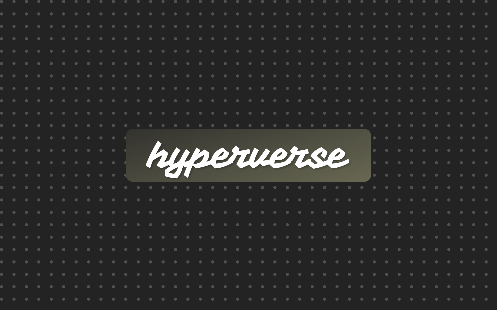

> Your server returns HTML. The browser swaps it. No React, no state management, no build step — just R.

The hyperverse is an ecosystem of R packages for building server-driven web applications using [htmx](https://htmx.org) and [plumber2](https://plumber2.posit.co). The philosophy is simple: your server returns HTML, the browser swaps it. No React, no state management, no build step.

🌐 [hyperverse.world](http://hyperverse.world/)

---

### Packages

| Package | Role | Status |
|---------|------|--------|
| [htmxr](https://github.com/hyperverse-r/htmxr) | Core — htmx primitives and plumber2 integration | [](https://cran.r-project.org/package=htmxr) |
| htmxr.bootstrap | Opinionated Bootstrap layer on top of htmxr | In development |
| htmxr.daisy | Opinionated DaisyUI layer on top of htmxr | In development |
| alpiner | Alpine.js wrapper — declarative client-side logic | Planned |
| supar | Supabase client for R — query your database over HTTP without writing SQL | Planned |

---

### Philosophy

- **HTML over the wire** — servers return HTML fragments, not JSON
- **CSS-agnostic core** — bring your own CSS framework, or use `htmxr.bootstrap` / `htmxr.daisy`
- **R-idiomatic** — every primitive is a function, autocompleted and documented, no raw HTML attributes
- **Shiny alternative** — familiar patterns for R developers, no JavaScript required

---

### Get started

**From CRAN:**

```r
install.packages("htmxr")
```

**Development version:**

```r
pak::pak("hyperverse-r/htmxr")
```

```r
library(htmxr)
hx_run_example("hello")
```
